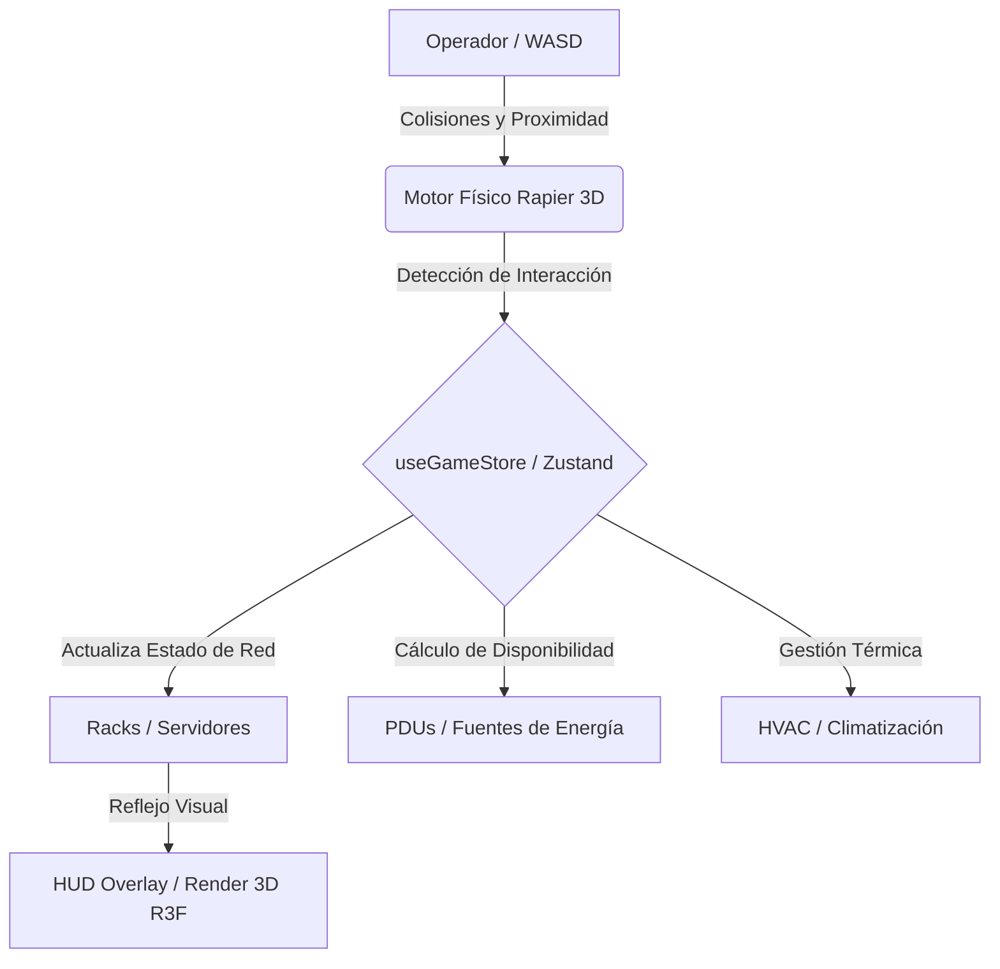
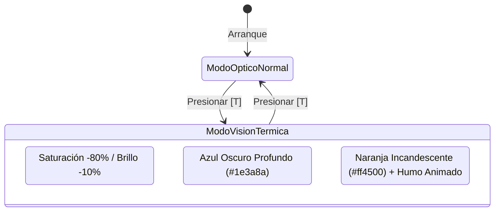

# 🏛️ Informe Técnico y Especificación de Arquitectura — DC Game (Simulador 3D DCCA)

---

## 1. Introducción y Visión General

**`dc-game`** es un simulador 3D isométrico de mundo abierto, de alta fidelidad visual y física, diseñado para la capacitación técnica de operadores de centros de datos en el marco de la certificación **DCCA (Data Center Certified Associate)**.

A diferencia de las plataformas tradicionales basadas en exámenes de selección múltiple, el simulador desacopla el aprendizaje teórico y lo convierte en mecánicas de interacción directa en tiempo real. El jugador asume el rol físico de un operador técnico dentro de una sala blanca de Data Center, enfrentándose a incidentes reales de infraestructura: dimensionamiento eléctrico según el código NEC, mitigación de Puntos Únicos de Fallo (SPOF), estrangulamiento de rendimiento de red (Bottlenecks) y gestión térmica.

---

## 2. Arquitectura de Estado Global (`useGameStore`)

El núcleo lógico del juego está gestionado de forma reactiva a través de **Zustand**, centralizando el entorno físico, las propiedades técnicas de los gabinetes (Racks), el inventario del jugador y el cumplimiento de objetivos de certificación.

### 2.1. Estructura de Datos de los Racks (`RackState`)
Cada gabinete en el Data Center mantiene un estado técnico independiente con las siguientes propiedades:
* **Identificación y Rol:** `id`, `name` (ej. *DB Primary Core*), `role` y coordenadas en el espacio 3D (`[x, y, z]`).
* **Estado Eléctrico:**
  * `psuAConnected`: Booleano que indica si la fuente de alimentación primaria está conectada a la PDU-A.
  * `psuBConnected`: Booleano que indica si la fuente de alimentación secundaria redundante está conectada a la PDU-B.
  * `requiredAmps`: Amperaje de carga continua demandada por los servidores del rack (ej. 16A, 32A, 64A).
  * `currentAwg`: Calibre del cableado de potencia instalado (`awg14`, `awg12`, `awg10`, `awg2`).
* **Estado de Red:**
  * `dataStandard`: Estándar del patch cord de datos actual (`cat5e`, `cat6a`, `fiber-om3`).
  * `backboneStandard`: Requisito mínimo del canal troncal para evitar estrangulamiento.
* **Banderas de Estado en Tiempo Real (Flags):**
  * `isOn`: Calculado dinámicamente. El rack tiene energía si al menos una fuente (PSU-A o PSU-B) está conectada a una PDU activa (`pduAOnline` o `pduBOnline`).
  * `hasSpof`: `true` si el gabinete depende de una única fuente de energía (PSU-A o PSU-B, pero no ambas).
  * `isBottleneck`: `true` si `dataStandard` es inferior a `backboneStandard` (ej. cable Cat 5e en un backbone de Fibra OM3 de 10G).
  * `isOverheating`: `true` si el calibre del cable eléctrico no cumple la regla de de-rating (ej. AWG 14 para 16A continuos).

---

## 3. Lógica y Reglas de Negocio Curricular (DCCA)

El motor lógico evalúa continuamente tres grandes pilares de la infraestructura de centros de datos:

### 3.1. Regla Eléctrica de De-rating NEC (80% Continuous Load)
Según el *National Electrical Code (NEC)*, un circuito sometido a carga continua (operación por 3 horas o más) solo puede cargarse hasta el 80% de la capacidad nominal del conductor.
$$\text{Capacidad Requerida (A)} = \frac{\text{Carga Continua (A)}}{0.8}$$
* **Aplicación en el Simulador:** 
  * Si un servidor demanda 16A continuos, requiere un conductor con capacidad de al menos $16 / 0.8 = 20\text{A}$.
  * El conductor **AWG 14** soporta un máximo de 15A. Si el jugador instala AWG 14 en el *Rack #2* (carga de 16A), el sistema detecta una violación a la norma. El flag `isOverheating` cambia a `true`, el rack se torna incandescente en la vista térmica y emite humo.
  * Al actualizar el cable a **AWG 12** (capacidad de 20A), el circuito se estabiliza y el objetivo se marca como completado.

### 3.2. Regla de Cuello de Botella de Red (The Bottleneck Rule)
La velocidad máxima de transmisión de un canal de datos completo está dictada por el componente de menor rendimiento en la cadena de conexión.
* **Aplicación en el Simulador:**
  * El *Rack #3 (DB Primary Core)* opera sobre un canal troncal de fibra óptica multimodo **OM3 de 10 Gbps**.
  * Inicialmente, el gabinete tiene instalado un patch cord de cobre **Cat 5e** (limitado físicamente a 1 Gbps). Esto genera un cuello de botella severo (`isBottleneck: true`), provocando destellos de advertencia en el gabinete y reduciendo el rendimiento general de la base de datos.
  * El operador debe abrir su inventario, equipar el cable **OM3 Fiber** y sustituir el patch cord en el panel de interacción para restaurar el flujo de 10 Gbps.

### 3.3. Eliminación de Puntos Únicos de Fallo (SPOF Mitigation)
Para alcanzar clasificaciones de disponibilidad Tier III / Tier IV, ningún servidor de misión crítica puede desconectarse ante un único fallo de infraestructura eléctrica.
* **Aplicación en el Simulador:**
  * El Data Center cuenta con dos cuadros de distribución independientes: **PDU-A** (alimentación primaria) y **PDU-B** (alimentación de respaldo).
  * Si un servidor tiene conectada únicamente la PSU-A, el flag `hasSpof` se activa y una baliza naranja de peligro gira en la parte superior del rack.
  * Si el jugador simula un fallo apagando la PDU-A desde el HUD, todos los servidores con SPOF se apagan instantáneamente (`isOn: false`).
  * Para resolverlo, el operador debe caminar hacia el gabinete y conectar el cable de alimentación secundaria (PSU-B) hacia la PDU-B.

---

## 4. Motor 3D, Físicas y Renderizado Cinemático

### 4.1. Físicas y Colisiones (`@react-three/rapier`)
El entorno físico está impulsado por el motor **Rapier**, que procesa colisiones rígidas y evita que el personaje atraviese estructuras físicas.
* **El Operador (`Operator.tsx`):** Instancia un cuerpo rígido (`RigidBody`) dinámico con un colisionador de tipo caja (`cuboid`). Su rotación física está bloqueada en los ejes X y Z para evitar vuelcos al chocar con las paredes.
* **Movimiento Físico Cinético:** Al presionar `WASD` o las flechas de dirección, el bucle de renderizado (`useFrame`) calcula un vector de velocidad en el plano XZ. Si el movimiento es diagonal, el vector se normaliza matemáticamente ($\times 0.7071$) para asegurar que la velocidad de desplazamiento sea constante ($8.0\text{ m/s}$). El cuerpo rígido recibe este impulso mediante `setLinvel()`.
* **Cámara Isométrica de Seguimiento:** La cámara ortográfica de Three.js no está estática; utiliza una interpolación lineal suave (`lerp`) en cada fotograma para seguir la traslación del operador manteniendo una perspectiva isométrica cenital constante (`[pos.x + 15, pos.y + 20, pos.z + 15]`).
* **Suelo y Racks Estáticos:** Todas las paredes, cuadros eléctricos de pared y gabinetes de servidores están declarados como cuerpos rígidos fijos (`type="fixed"`).

### 4.2. Detección de Proximidad e Interactividad
La interacción con el entorno no depende de clics lejanos o punteros en pantalla, reforzando la inmersión de simulación física:
1. En cada ciclo de CPU (`useFrame`), el operador calcula la distancia euclidiana ($\sqrt{(x_2 - x_1)^2 + (z_2 - z_1)^2}$) entre su centro de masa y las coordenadas de todos los Racks y PDUs.
2. Si la distancia es inferior al umbral de proximidad ($3.8\text{ metros}$), el sistema despacha la acción `setActiveInteraction("rack", id)` al store de Zustand.
3. Esto activa instantáneamente el **Borde de Selección (Outline)**: una malla emisiva de alambre de neón cian envuelve al gabinete objetivo y un anillo proyectado en el piso señala la base del rack.
4. Al presionar `[Espacio]` o `[Enter]`, la UI reacciona abriendo el modal de inspección técnica del gabinete.

### 4.3. Dirección de Arte y Postprocesamiento (`@react-three/postprocessing`)
El simulador implementa un pipeline de renderizado avanzado para alcanzar un acabado visual inmersivo, limpio e industrial:
* **Suelo Técnico Ajedrezado:** Baldosas de color gris industrial claro (`#cbd5e1` y `#e2e8f0`) configuradas con una rugosidad baja (`roughness: 0.25`) y un toque metálico (`metalness: 0.15`). Esto permite que los LEDs frontales de los blades de servidores y el chaleco reflectante del personaje generen reflejos especulares en el piso en tiempo real.
* **Zonificación Térmica por Luces y Neón:** Tiras brillantes en el suelo marcan los perímetros del Pasillo Frío (celeste) y Pasillo Caliente (rojo). Luces de relleno omnidireccionales (`PointLight`) inyectan una atmósfera azulada en el frente de los servidores y anaranjada en la parte posterior.
* **Sombras Suaves (Soft Shadows):** Una luz direccional en picado de alta resolución ($4096 \times 4096$) proyecta sombras nítidas con sesgo normal (`shadow-normalBias: 0.02`) para evitar artefactos de auto-sombreado (Peter-panning).
* **Cinematic Bloom:** El efecto de postprocesamiento de floración (`Bloom`) hace que todas las texturas con valores emisivos altos (LEDs de estado, balizas de emergencia y mallas de alambre de selección) brillen intensamente con un aura de neón difuso.

### 4.4. Modo de Visión Térmica `[T]`
Al presionar la tecla `T`, el operador activa el escáner infrarrojo del Data Center, transformando drásticamente el renderizado 3D:

1. **Filtro de Postprocesamiento:** `HueSaturation` desatura el entorno al $-80\%$ y `BrightnessContrast` oscurece el fondo, eliminando los colores reflectantes del suelo y las paredes.
2. **Degradado Térmico Dinámico en Racks:** Los gabinetes en estado óptimo cambian su material a un azul frío profundo (`#1e3a8a`). Los gabinetes que sufren sobrecalentamiento (`isOverheating: true`, como el Rack #2 con cable AWG 14) transicionan mediante interpolación de color hacia un rojo de fuego incandescente (`#ff4500`).
3. **Emisión de Partículas Infrarojas:** Puntos flotantes (`Points`) con mezcla aditiva (`AdditiveBlending`) se generan sobre los racks sobrecalentados simulando el ascenso de columnas de calor.

---

## 5. Interfaz de Usuario (HUD Overlay y Consola de Inspección)

La capa de usuario está construida sobre React 19 y Tailwind CSS, posicionada en una capa absoluta sin eventos de puntero (`pointer-events-none`) para no bloquear el lienzo 3D, habilitando la interactividad únicamente en los botones y paneles flotantes (`pointer-events-auto`).

### 5.1. Componentes del HUD
* **Barra Superior de Estado Ambiental:** Muestra el título del simulador, un LED verde de latido del sistema y botones interactivos para controlar el estado de energía de la **PDU-A**, **PDU-B** y el sistema de climatización **HVAC**.
* **Ventana de Misiones en Tiempo Real (DCCA Objectives):** Un panel lateral translúcido estilo Sci-Fi/Cyberpunk que lista las tareas activas de infraestructura (ej. *Eliminar SPOF en Rack 3*, *Solucionar cable de potencia sobrecalentado*). A medida que el jugador realiza conexiones físicas correctas, el bucle `checkObjectives()` de Zustand marca las casillas con un ícono de verificación verde.
* **Barra de Inventario (Quick Slots):** Ubicada en la parte inferior central, permite al jugador alternar rápidamente entre herramientas e insumos (cables Cat6a, Fibra Óptica OM3, cables de potencia AWG 12/AWG 2 y el escáner térmico) presionando las teclas numéricas `1` al `5` o haciendo clic.

### 5.2. Modal de Inspección Técnica de Gabinete
Cuando el jugador está en el radio de un Rack y presiona la barra espaciadora, se despliega la consola técnica del servidor:
* **Sección ① Redundancia Eléctrica:** Permite conectar o desconectar de forma independiente las fuentes primarias (PSU-A) y secundarias (PSU-B).
* **Sección ② Calibre Eléctrico AWG:** Muestra la demanda de amperaje continua del rack y ofrece un selector de 4 botones para cambiar el conductor de cobre instalado, reflejando inmediatamente si la capacidad del cable soporta o no la carga.
* **Sección ③ Estándar de Patch Cord de Red:** Despliega el requisito troncal del Data Center (Backbone) y permite sustituir el latiguillo de conexión, actualizando en tiempo real la advertencia de cuello de botella.
